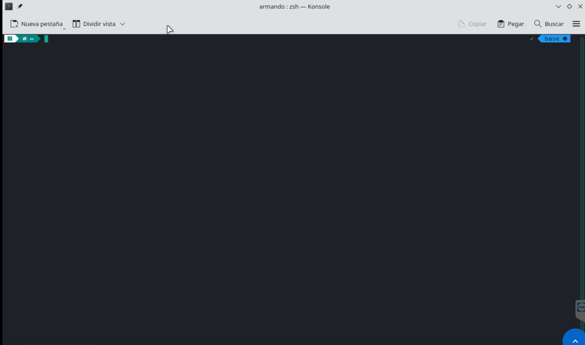

# labOne

# **🧑‍💻 COMO INSTALAR LINUX MINT 👩‍💻**

## **📌 INTRODUCCIÓN**

 

## **📖 Como instalar Linux Mint**

**Descargar la imagen ISO de Linux Mint:** Ve al sitio web oficial de Linux Mint (https://www.linuxmint.com/) y descarga la versión de Linux Mint que desees. Asegúrate de elegir la versión correcta para tu arquitectura de sistema (32 bits o 64 bits), yo elegi la Cinnamon Edition.

**Crear una memoria USB de arranque:** Necesitarás una memoria USB vacía con al menos 4 GB de espacio. Utiliza una herramienta como "Rufus" en Windows o "Etcher" en macOS y Linux para crear una memoria USB de arranque utilizando la imagen ISO que descargaste. Estas herramientas copiarán los archivos necesarios y harán que la memoria USB sea arrancable.

**Realiza una particion en tu disco:** Yo destine 100 GB en la particion (minimo usa 30GB, lo recomendamos por experiencia), Reinicia tu computadora y accede a la configuración del BIOS o UEFI. Configura el orden de arranque para que la memoria USB sea la primera opción de arranque.

**Iniciar la instalación:**  En el menú de inicio de Linux Mint, elige la opción "Instalar Linux Mint". Esto iniciará el instalador gráfico, prueba antes el teclado.

**Seleccionar opciones de instalación:** Puedes optar por instalar software de terceros (como códecs multimedia) y también puedes elegir entre "Instalación normal" o "Opciones avanzadas" para particionar el disco manualmente si lo deseas.

**Elegir tipo de instalación:** Puedes optar por instalar Linux Mint junto a tu sistema operativo actual, reemplazarlo o configurar las particiones manualmente. Sigue las instrucciones según tu preferencia.

**Configurar usuario y contraseña:** Proporciona un nombre de usuario y una contraseña para tu cuenta en Linux Mint.

**Esperar a que finalice la instalación:** El instalador copiará los archivos y configurará tu sistema. Este proceso puede demorar algunos minutos.

**Reiniciar:** Una vez que se complete la instalación, reinicia tu computadora.

**Retirar la memoria USB:** Después de reiniciar y asegurarte de que todo funcione correctamente, puedes retirar la memoria USB.

**Por nada olvides cambiar en tu Bios el scurity Boot:** Este fue un error que nos quito mucho tiempo y evita que la GRUB carge correctamente.

## **Instalacion de paquetes y herramientas**

**Descargar miniconda:** Una vez instalada de manera correcta linux, abrimos el navegador y descargamos la ultima version de miniconda desde la pagina oficial, (https://docs.conda.io/en/latest/miniconda.html#linux-installers), la cual es una version mas compacta del repositorio conda para linux.

**Instalar miniconda:** ya descargado el archivo de miniconda, lo buscamonos en la terminal de linux en la carpeta de descargas y lo extraemos usando el siguiente codigo:

> bash Miniconda3-latest-Linux-x86_64.sh

una vez instalado reiniciamos la terminal.

**Inicializar miniconda:** Una vez reiniciada la terminal, aparece la carpeta miniconda3, en la cual seguimos los siguientes comandos:

> ~/miniconda3/bin/conda init bash
> ~/miniconda3/bin/conda init zsh

Se verifica que se haya instalado correctamente si en consola aparece (base) en una de las esquinas superiores de la terminal. Tal como se muestra en la siguiente imagen.

**Instalar herramientas:** Para instalar las herramientas necesarias, configuramos digital y python y la activamos como la variable de entorno con el siguite codigo:

> ~/miniconda3/bin/conda create -n digital python=3.10

> ~/miniconda3/bin/conda activate digital

ya dentro del entorno de digital usamos los siguientes codigos para instalar las herramientas.

>  ~/miniconda3/bin/conda install -c conda-forge gtkwave

>  ~/miniconda3/bin/conda install -c conda-forge graphviz

>  ~/miniconda3/bin/conda install -c symbiflow netlistsvg

>  ~/miniconda3/bin/conda install -c "litex-hub" yosys

>  ~/miniconda3/bin/conda install -c "litex-hub" iverilog

**Instalar digital:** Para instalar digital se requiere la máquina virtual de java, se puede comprojar si está instalada con el siguiente comando:

> java --version

Y en caso de no estar instalada se pueden usar eeste enlace (https://adoptium.net/) o los siguientes codigos:

> $ sudo apt install openjdk-11-jdk # > Si es una distribución basada en debian
> $ pamac install jdk-openjdk # > Si es una distribución basada en arch

Por ultimo se descarga la carpeta de digital (https://github.com/hneemann/Digital/releases/latest/download/Digital.zip) para despues usar el codigo java -jar Digital.jar en la terminal de Linux para descomprimirlo. Y si se desea dejar un acceso directo a digital desde del menu de aplicaciones se debe ejecutar el codigo: ./install.sh en el directorio donde se encuentra Digitak.jar.

Visualización de la interfaz gráfica de digital.
